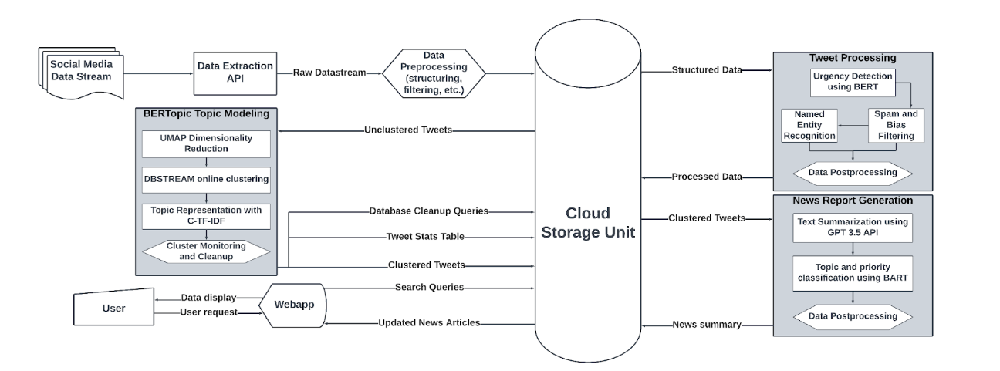
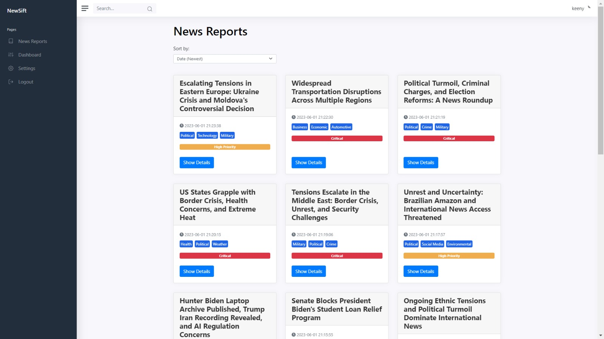
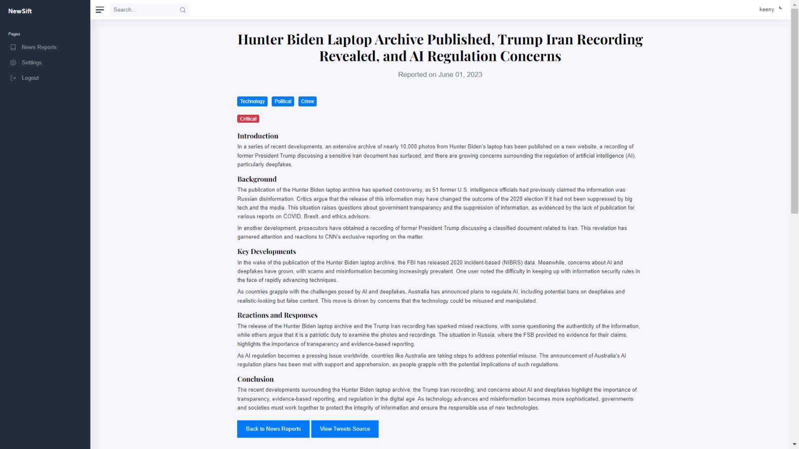
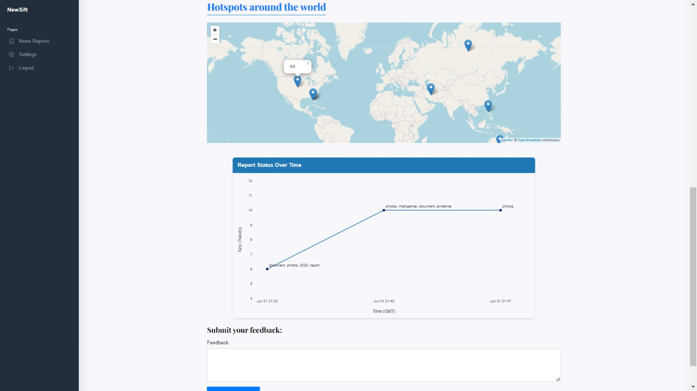
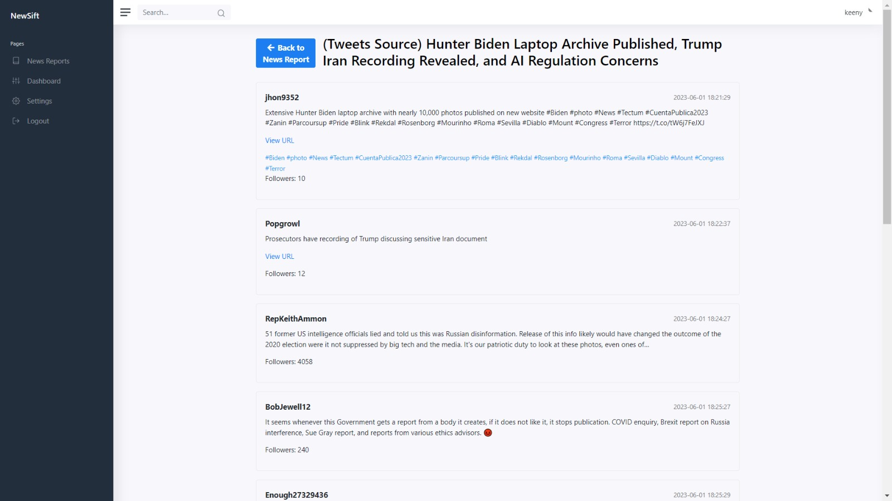

# Automated News Generation - Web Application


This project is part of our Senior Thesis at Zewail City titled ***Real-Time News Aggregation and Summarization from Twitter Streams for Enhanced Information Access and Decision Making***. It involves the development of an application for the automated generating news reports from Twitter data. The app applies various machine learning models, NLP analysis techniques, and clustering algorithms to extract informative and news-worthy information from tweets.

## Table of Contents
- [Project Overview](#project-overview)
- [System Block Diagram](#system-block-diagram)
- [Demo (Illustrating Web App Features)](#demo-illustrating-web-app-features)
- [File Structure](#file-structure)
  - [twitter_mongoDB](#twitter_mongodb)
  - [tweet_processor.py](#tweet_processorpy)
  - [tweet_cluster.py](#tweet_clusterpy)
  - [generate_newsreports.py](#generate_newsreportspy)
  - [NewSift](#newsift)
- [Setup and Installation](#setup-and-installation)
- [Authors](#authors)
- [About the Authors](#about-the-authors)
- [Contact Us](#contact-us)
## Project Overview

The purpose of this project is to create an automated system that streams data from Twitter, processes it using ML and NLP models, clusters tweets based on similarity, generates news reports from the clustered tweets, and visualizes the reports and associated locations on a web application. The app aims to provide users with real-time news updates and insights by analyzing the Twitter stream.
## System Block Diagram
  

## Demo (Illustrating Web App Features)
A visual tour of our web application and showcase its exciting features.

1. Browse News Reports: Users can easily navigate through the news reports and sort them by date or priority.

2. Read Full Reports and View Locations: Users have the option to access the full news report, explore the associated locations on a world map, and monitor the report status through the provided graph.


3. Access Original Source Tweets: Users can also view the original source tweets associated with each report, providing them with additional context and information.


## File Structure
```
.
├── twitter_mongoDB/
│   ├── config.py
│   └── (streaming files)
├── NewSift/
│   ├── (Flask app files)
│   ├── requirements.txt
│   └── run.py
├── tweet_processor.py
├── tweet_cluster.py
├── generate_newsreports.py
├── (ML and NLP models)
├── README.md
└── requirements.txt
```


### twitter_mongoDB

This directory contains the files responsible for streaming data from Twitter and saving it into a MongoDB database. To set up the configuration, create a `config.py` file inside this directory and add your [Twitter API keys](https://developer.twitter.com/en/products/twitter-api) and tokens as well as your [MongoDB client](https://www.mongodb.com) information.

### tweet_processor.py

This file is the main script for pulling data from Twitter, applying ML and NLP models, and saving the processed data back to MongoDB. To run this file, use the following options:

- `--keywords` or `-k`: List of comma-separated keywords for filtering tweets (used for the [filtered stream](https://developer.twitter.com/en/docs/twitter-api/tweets/filtered-stream/introduction)).
- `--num_tweets` or `-n`: Number of tweets to stream.
- `--batch_size` or `-b`: Batch size of streamed tweets (the streamer works in batches until it finishes the total number of tweets).

### tweet_cluster.py

This file is responsible for dynamically clustering tweets at regular intervals. Each tweet is assigned to an existing cluster or creates a new cluster if the tweet's distance is far from all existing clusters.

### generate_newsreports.py

This file generates news reports from the clustered tweets. It examines existing reports and checks if enough tweets are added for the associated cluster. It updates the report if necessary, or generates a new report if a new cluster is added.

### NewSift

This directory contains the [Flask app](https://flask.palletsprojects.com/en/2.3.x/) used to build the web interface for the project. To run the app, first install the requirements specified in the `requirements.txt` file in a separate environment from the main project's environment. Then, run the app with `python run.py`.

## Setup and Installation

1. Clone the repository to your local machine.
2. Set up a Python virtual environment and activate it.
3. Install the main project requirements using `pip install -r requirements.txt`.
4. Inside the twitter_mongoDB/ directory, create a config.py file and provide your Twitter API keys, tokens, and MongoDB client configuration.
5. Run tweet_processor.py with the desired options to stream and process tweets from Twitter.
6. Download urgency detection model weights from [gdrive](https://drive.google.com/drive/folders/1OrJa_JhlOie-Cajw61OQcVtclFSFZ12k?usp=drive_link) and place them in the main project directory
7. Run tweet_cluster.py to perform dynamic clustering of tweets at regular intervals.
8. Run generate_newsreports.py to generate news reports from the clustered tweets.
9. Navigate to the NewSift/ directory and set up a separate Python environment for the Flask app.
10. Install the app requirements using pip install -r requirements.txt.
11. Run the Flask app by executing python run.py.
12. Access the web application in your browser to browse news reports, view associated locations on an interactive world map, and monitor report status through the provided graph.

## Authors
- [Mohamed Ahmed](https://github.com/mk-khalil)
- [Khaled El Bastawesy](https://github.com/khaledElbastawisy)
- [Hazem Tarek](https://github.com/HazemTarek1080)

## About the Authors
We are a team of students at the Communications and Information Engineering Department at Zewail City of Science and Technology. This project is part of our final year Senior Thesis.


## Contact Us <a name="contact"></a>
Thank you for exploring our project! Feel free to reach out to us if you have any questions or feedback. 

To contact us:

s-mohamed.khalil@zewailcity.edu.eg

s-khaledebrahim000@zewailcity.edu.eg

s-hazem_tarek1080@zewailcity.edu.eg